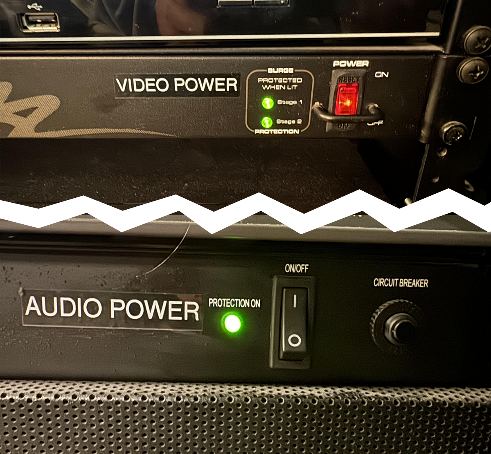
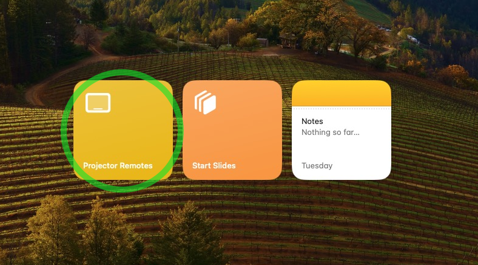
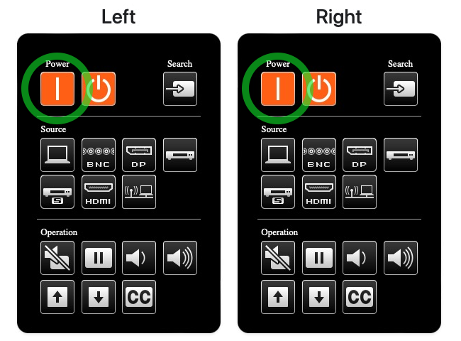
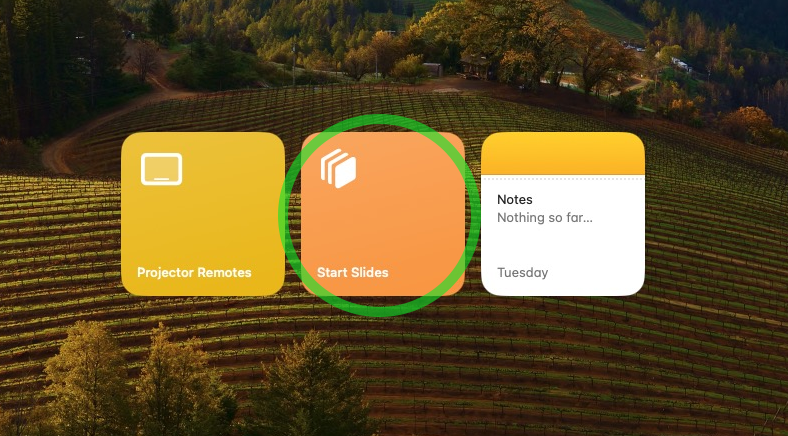
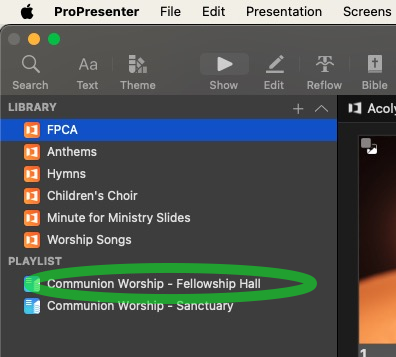
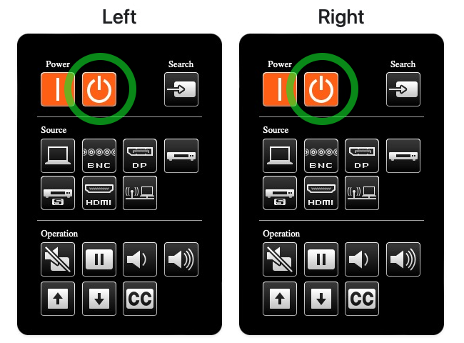

# Slideshows Quick Start Guide

!!! note "1. Getting Started**"
  
    - The SlideShow Computer in Fellowship Hall should already be powered on, if not, press the power button on the Computer behind the Left monitor in the projection booth (Mac Studio).
    - If the computer asks for a password, it is **`fpca`** (all lowercase).
    - Turn on the Video and Audio power switches on the rack in the projection booth.
    

!!! note "2. Powering on the Projectors"

    - The projectors can be powered on remotely by clicking the **Projector Remotes** button on the Slideshow Computer.
    
    - Click the **Power On** button for both projectors. The projectors will take a few moments to warm up and display the image.
    
  
!!! note "3. Launching ProPresenter"

    - Open ProPresenter by clicking on the **Start Slides** button on the Slideshow Computer.
    

    > ***Note:** ProPresenter 7 will open automatically. If it does not, click on the ProPresenter icon in the dock at the bottom of the screen.*

!!! note "4. Loading the Slideshow"

    - If you presenting slides on Sunday Morning, the shlidshow should already be loaded. Locate the correct **Playlist** in the _left sidebar_ and click on it to load the slides.
  
      

!!! example "**Quick Info About ProPresenter**"
    - It is essenetially a more powerful version of PowerPoint. For now, let's focus on the basics... Playlists, Presentations and Slides.

    - A **Playlist** is a collection of **Presentations**. A **Presentation** is a collection of **Slides**.

    - There is a preview of the current slide in the top right corner of the screen, as well as on the monitor mounted above the main monitor.

!!! note "5. Controlling the Slideshow"

    - To advance to next slide, press the ++space++ or the ++right++ key on the keyboard. You may also click on any slide to change to that slide.
    - To go back to the previous slide, press the ++left++ key on the keyboard.
    - To go to the next Presentation in the Playlist, press the ++down++, and to go to the previous Presentation, press the ++up++. Note: This will NOT display the first slide in the new Presentation, you will need to press the ++space++ to display the first slide.

    > ***Pro-tip:** Utilizing blank slides is a great way to find your place if you lose track of where you are in the slideshow. Quickly select a blank slide and then find your place in the presentation.*

!!! note "6. Ending the Slideshow"
    - It is best practice to allow the announcement slides to run at least once after Worship ends, so after the Benediction scroll back up to the Welcome & Announcemnts sectiona and click the Announcements slide to display it.
    - Once it's time to shut down, start by quitting ProPresenter. You can do this by clicking on the **ProPresenter** menu in the top left corner of the screen and selecting **Quit ProPresenter**, or by pressing ++cmd+q++ on the keyboard.

!!! note "7. Powering off the Projectors"
    - Next, power off the projectors by clicking the **Projector Remotes** button on the Slideshow Computer and clicking the **Power Off** button for both projectors. (If the remotes window is closed, you can reopen it by clicking the **Projector Remotes** button again on the desktop.)
    

    > ***Note:** Please leave the Slideshow Computer on, as the Worship Tech Director may need to access it remotely.*

!!! note "8. Powering off the AV Rack"
    - Finally, turn off the Video and Audio power switches on the rack in the projection booth.
    

